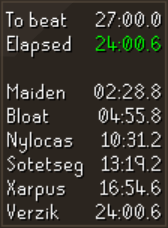
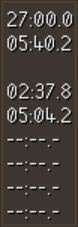
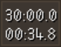

# Theatre of Blood: Hard Mode Timer
The TOB Hard Mode Timer is a plugin to track the time to beat in the Theatre of Blood: Hard Mode. Current features are:
* Time to beat
* Time elapsed
* Time remaining
* Boss splits

## Examples
The overlay of the plugin can be configured to display a variety of data. Here are some examples of the posibilities:

## Changed
All changes to the plugin are tracked in the [Changelog](CHANGELOG.md)

## Feedback
Feel free to open an issue in this repository to provide feedback on the plugin. Feature requests are welcome as well!
